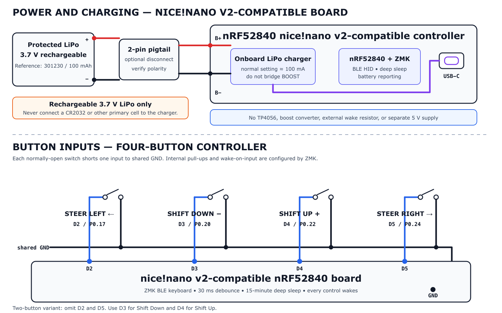

# MyWhoosh ESP32-C3 Handlebar Controller

A printable, battery-powered Bluetooth Low Energy keyboard controller for **MyWhoosh on macOS**. Choose either a compact two-button shifter or a four-button shifter with steering. Both variants pair directly with a MacBook and require no companion app or keyboard remapping.

## Schematic



## Choose a variant

| Variant     | Controls                                                 | Printed width | Folder                                          |
| ----------- | -------------------------------------------------------- | ------------: | ----------------------------------------------- |
| Two button  | Shift down `k`, shift up `i`                             |         64 mm | [`variants/two-button`](variants/two-button/)   |
| Four button | Inline rectangle: steer left, shift down/up, steer right |    80 × 38 mm | [`variants/four-button`](variants/four-button/) |

Each variant folder contains its own firmware, parametric OpenSCAD enclosure, ready-to-slice bottom and lid STLs, and variant-specific instructions. Do not mix a bottom and lid from different variants because their lengths and snap positions differ.

## What you need

| Item                                         |   Two button |  Four button | Notes                                                              |
| -------------------------------------------- | -----------: | -----------: | ------------------------------------------------------------------ |
| ESP32-C3 SuperMini                           |            1 |            1 | USB-C version; approximately 23.5 × 18.5 mm                        |
| 12 × 12 × 7.3 mm tactile switch              |            2 |            4 | Common switches with coloured caps                                 |
| Thin stranded or silicone wire               | 3 conductors | 5 conductors | Buttons share one ground connection; allow more for battery wiring |
| Zip tie, up to 5 mm wide                     |            2 |            2 | Enclosure saddle is sized for a 31.8 mm handlebar                  |
| Single-cell LiPo, 3.7 V                      |            1 |            1 | Choose a capacity and physical size that fit the enclosure         |
| TP4056 Type-C charger module with protection |            1 |            1 | For charging and protecting one Li-ion/LiPo cell                   |
| Regulated 5 V boost converter                |            1 |            1 | Supplies the ESP32 from the varying battery voltage                |
| 10 kΩ resistor                               |            1 |            1 | External pull-up for the GPIO3 Shift Up/wake button                |
| USB-C data cable                             |            1 |            1 | Used for flashing the ESP32 and charging through the TP4056        |

You will also need a soldering iron and VS Code with the PlatformIO extension, or the PlatformIO CLI.

## Repository layout

```text
.
├── platformio.ini                    # Two separate firmware environments
├── lib/ESP32_BLE_Keyboard/           # Shared vendored BLE HID library
└── variants/
    ├── two-button/
    │   ├── README.md
    │   ├── firmware/main.cpp
    │   └── mechanical/
    │       ├── enclosure.scad
    │       └── stl/{bottom,lid}.stl
    └── four-button/
        ├── README.md
        ├── firmware/main.cpp
        └── mechanical/
            ├── enclosure.scad
            └── stl/{bottom,lid}.stl
```

## Wiring

Every button connects its GPIO to GND when pressed, and the firmware enables each internal pull-up. Shift Up on GPIO3 is the only deep-sleep wake input. Connect a 10 kΩ resistor from GPIO3 to `3V3` for dependable wake-up; the other controls need no external resistor.

| Function        | GPIO | MyWhoosh keystroke | Variant          |
| --------------- | ---: | ------------------ | ---------------- |
| Shift up / wake |    3 | `i`                | Both             |
| Shift down      |    4 | `k`                | Both             |
| Steer left      |    5 | Left Arrow         | Four button only |
| Steer right     |    1 | Right Arrow        | Four button only |

On a four-leg tactile switch, the two legs on each side are already connected internally. Connect the GPIO to one side and GND to the opposite side. All buttons can share one GND wire.

The firmware deliberately enables wake-up only on GPIO3 so the `+ / power` control has one clear purpose when the controller is asleep. The four-button firmware uses arrow keys rather than `a` and `d` for steering.

## Build and flash

Open the repository root in PlatformIO, connect the ESP32-C3 SuperMini over USB-C, then upload the firmware matching the enclosure you printed.

Two-button firmware:

```sh
pio run -e two-button --target upload
```

Four-button firmware:

```sh
pio run -e four-button --target upload
```

The four-button environment is the default when `-e` is omitted. The first build downloads the pinned Espressif platform; the BLE keyboard library is already included.

If uploading does not start, hold **BOOT**, tap **RESET**, release **BOOT**, and upload again. Serial diagnostics are available at 115200 baud with `pio device monitor`.

## Pair with the MacBook

1. Power the controller and open **System Settings → Bluetooth** on the Mac.
2. Select **MyWhooshShift** and complete pairing. If Keyboard Setup Assistant opens, identify it as a standard ANSI keyboard.
3. Test in TextEdit. Shift buttons type `i` and `k`; the four-button steering controls move the cursor left and right.
4. Open MyWhoosh, start a ride, keep the game focused, and test the controls.

Each input is debounced for 30 ms and sends one keystroke per physical press. A held button does not repeat. After 15 minutes without a button press, the controller enters deep sleep and disconnects from Bluetooth. Only Shift Up—the lid control marked `+ / power`—wakes it. The wake press is consumed, so release the button, wait for the Mac to reconnect, then press again to shift up. Change `kSleepTimeoutMs` in the selected variant's `firmware/main.cpp` to use another timeout.

If an old pairing causes problems, choose **Forget This Device**, restart the controller, and pair it again.

## Print and assemble

Use the `bottom.stl` and `lid.stl` from the same variant folder. Recommended slicer settings:

- PETG preferred; PLA is suitable for an indoor trainer
- 0.20 mm layer height
- 3 walls/perimeters
- 25–30% infill
- No supports
- Bottom open side facing up
- Lid flat outside face on the build plate

The SCAD sources are parameterized for common 23.5 × 18.5 mm SuperMini boards, 12 mm switches, 5 mm zip ties, and 31.8 mm handlebars. Measure clone boards and switch caps before a full print.

Assembly is the same for either variant:

1. Prototype the complete battery, charger, boost converter, ESP32, and button circuit on the breadboard.
2. Set and verify the disconnected boost converter at 5.0 V, then power, flash, and pair the ESP32.
3. Solder each GPIO to its assigned switch, connect the opposite switch terminals to a shared GND, and add the 10 kΩ pull-up between GPIO3 and `3V3`.
4. Fit switches into the guides beneath the labelled lid. Add a small spot of hot glue only if needed.
5. Insulate every power module and connection with heat-shrink or suitable electrical insulation.
6. Position the battery without bending or clamping its pouch, then secure the rigid modules so they cannot rub against it.
7. Slide the ESP32 into its rails with USB-C facing the side opening.
8. Route wires clear of the lid skirt and snap the matching lid into the bottom without forcing it.
9. Pass two zip ties through the floor slots and tighten the saddle evenly against the handlebar.

The enclosure is not waterproof. Consider PCB conformal coating and a thin lid gasket for heavy indoor use.

## Battery power and charging

The controller uses a single-cell 3.7 V LiPo. Choose a cell whose capacity, dimensions, connector, and wire exit suit the enclosure. The TP4056 module charges the cell and its protection circuit provides protected battery output, but that output follows the cell voltage—it is not regulated 5 V. Add a compact boost converter and set its output to 5.0 V with a multimeter **before** connecting the ESP32.

```text
USB-C charger
      │
      ▼
TP4056 Type-C module
  B+ / B-  ◄──── single-cell 3.7 V LiPo
 OUT+ / OUT-
      │
      ├────────────────── 5 V boost converter ── ESP32 5V
      └────────────────────────────────────────── ESP32 GND
```

There is no separate power switch. The protected battery output remains connected to the boost converter. After the inactivity timeout, the ESP32 enters deep sleep; pressing the Shift Up `+ / power` control wakes it. The other buttons do nothing until the controller wakes and reconnects.

Important battery rules:

- Verify battery-connector polarity with a multimeter; matching connectors do not guarantee matching wire polarity.
- Never connect the LiPo or TP4056 battery output directly to the ESP32 `3V3` pin. A fully charged single-cell LiPo can reach approximately 4.2 V.
- Do not connect the TP4056 output directly to the ESP32 `5V` pin and assume it is 5 V; use the regulated boost stage.
- Let the controller enter deep sleep before charging and do not operate it while charging. A basic TP4056 board has no load-sharing power path; deep sleep minimizes the connected load but does not electrically disconnect it. Use a charger module with proper power-path/load-sharing support if the controller must operate reliably while charging.
- Avoid powering the ESP32 simultaneously from its USB-C socket and the boost converter unless isolation or a proper power-path circuit has been added.
- Do not bend, crush, puncture, tightly clamp, or solder directly to the LiPo pouch. Stop using a swollen, damaged, hot, or leaking cell.

The battery, charger, boost converter, and wiring must be insulated and restrained so no module edge or printed feature presses into the pouch. Measure the chosen cell and modules before printing because dimensions, connectors, and wire exits vary. The firmware currently reports a fixed 100% BLE battery value because no voltage-sense divider is fitted.

## Troubleshooting

| Symptom                               | Check                                                                                                                         |
| ------------------------------------- | ----------------------------------------------------------------------------------------------------------------------------- |
| Device does not appear                | Confirm power and look for the ready message in the serial monitor                                                            |
| Controls do not work                  | Test in TextEdit and ensure MyWhoosh has keyboard focus                                                                       |
| Shift direction is reversed           | Swap GPIO 3/4 wires or the up/down key constants                                                                              |
| Steering is reversed                  | Swap GPIO 5/1 wires or the left/right key constants                                                                           |
| Actions occur without pressing        | Check for GPIO-to-GND shorts and switch terminal orientation                                                                  |
| Shift Up does not wake the controller | Confirm the `+ / power` control is wired to GPIO3, check its 10 kΩ pull-up to `3V3`, and verify the button pulls GPIO3 to GND |
| Enclosure is too tight                | Adjust `fit_clearance` or `board_clearance` in that variant's SCAD file                                                       |

## Credits

BLE HID support is based on [T-vK's ESP32-BLE-Keyboard](https://github.com/T-vK/ESP32-BLE-Keyboard), vendored here for reproducible builds.
